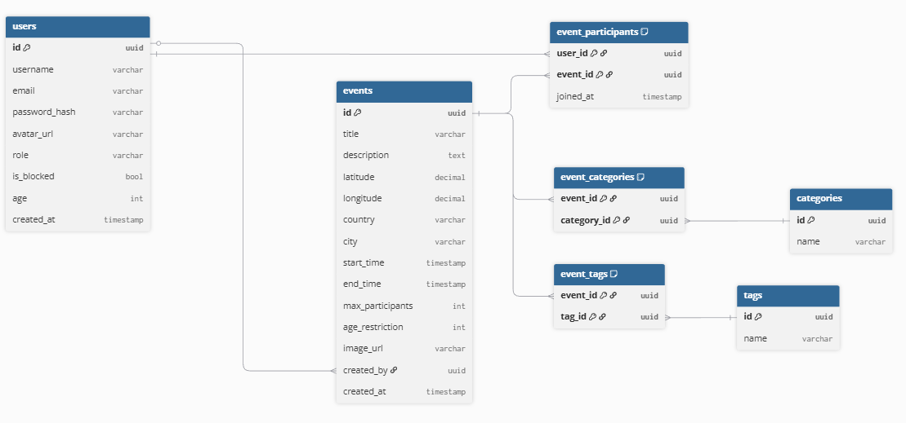

# Demo M3

## Architecture

```
┌─────────────┐     ┌─────────────┐  Http endpoints   ┌─────────────┐
│   Browser   │────>│   Frontend  │──────────────────>│   Backend   │
└─────────────┘     └─────────────┘                   └──────┬──────┘
                                                             │
                                                             v
                                                      ┌─────────────┐
                                                      │  DataBase   │
                                                      └─────────────┘
```

## DB Diagram



## API

### Responce formats

#### Data Responce

For one entity:
```json
{
  "data": {
    /* data responce body */
  }
}
```

For list of entities:
```json
{
  "data": [
    {
      /* data responce body */
    },
    {
      /* data responce body */
    }
  ]
}
```

#### Error Responce

```json
{
  "error": {
    "status": 404,
    "message": "User not found"
  }
}
```

### Requests

- Health
  - **Get** `/health` **Requires authorization:** No
- Auth
  - **POST** `/auth/login` **Requires authorization:** No
  - **DELETE** `/auth/logout` **Requires authorization:** Yes
  - **POST** `/auth/register` **Requires authorization:** No
  - **POST** `/auth/refresh` **Requires authorization:** No
- Users
  - **GET** `/users/{id}` **Requires authorization:** Yes
  - **PATCH** `/users/me` **Requires authorization:** Yes
  - **DELETE** `/users/me` **Requires authorization:** Yes
    - **PATCH** `/users/{id}/block` **Requires authorization:** Yes
    - **DELETE** `/users/{id}/block` **Requires authorization:** Yes
    - **PATCH** `/users/{id}/op` **Requires authorization:** Yes
    - **DELETE** `/users/{id}/op` **Requires authorization:** Yes
- Events
  - **POST** `/events` **Requires authorization:** Yes
  - **GET** `/events/{id}` **Requires authorization:** Yes
  - **GET** `/events` **Requires authorization:** Yes
  - **PATCH** `/events/{id}` **Requires authorization:** Yes
  - **DELETE** `/events/{id}` **Requires authorization:** Yes
- Event Participants
  - **POST** `/events/{id}/participants` **Requires authorization:** Yes
  - **DELETE** `/events/{id}/participants/me` **Requires authorization:** Yes
  - **GET** `/events/{id}/participants` **Requires authorization:** Yes
- Categories
  - **POST** `/categories` **Requires authorization:** Yes
  - **GET** `/categories` **Requires authorization:** No
    - Assign Category to event
    - **POST** `/events/{id}/categories/{category_id}` **Requires authorization:** Yes
    - **DELETE** `/events/{id}/categories/{category_id}` **Requires authorization:** Yes
- Tags
  - **POST** `/tags` **Requires authorization:** Yes
  - **GET** `/tags` **Requires authorization:** No
    - Assign Tag to Event
    - **POST** `/events/{id}/tags/{tag_id}` **Requires authorization:** Yes
    - **DELETE** `/events/{id}/tags/{tag_id}` **Requires authorization:** Yes

## Technical Stack

### Backend

- Programming Language: Java 21
- Framework: Spring Boot
- Database: PostgreSQL
- Database Migration Tool: Liquibase
- Message Broker: Apache Kafka

### Frontend

- Programming Language: JavaScript
- Framework: React (with Vite)
- Routing Library: React Router DOM
- Data Fetching Library: TanStack Query
- Mapping Library: React Leaflet
- Styling: CSS Modules
