# Demo M4

## About

The app is designed to search for, view, and plan local events. Users can:
- create their own events;
- filter events by category, time, and number of participants.
- find and join events;

## Current test coverages

Current code coverage:   
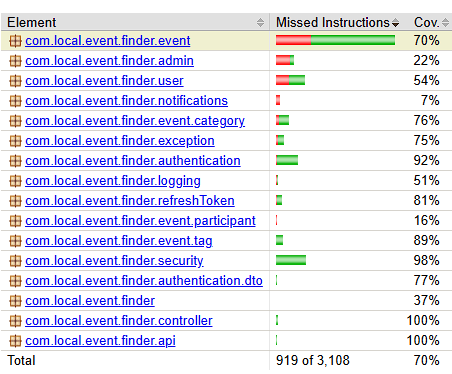

## Planned User Stories

### User Registration

> As a new user I want to register in the system To access the app's features.

In current app version user can register his account:   
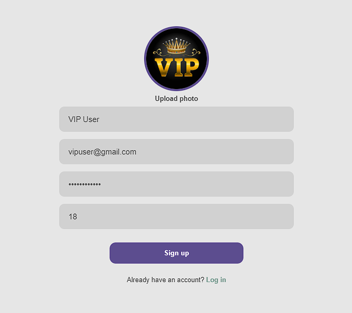

## Log In

> As a new user I want to register in the system To access the app's features

In current app version can log in his account:   
- 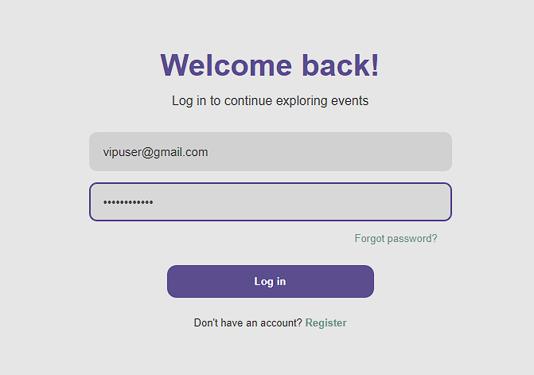
- 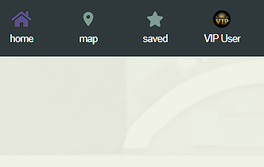

## Restricted access for guests

> As a developer I want to be restricted from accessing events and map So that only registered users can use core features

In current app version we have restriction access for guests:   
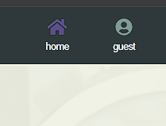

## Viewing Events on a Map

> As a user I want to see events on an interactive map So I can easily navigate and choose events that interest me

In current app version we have map with events:   
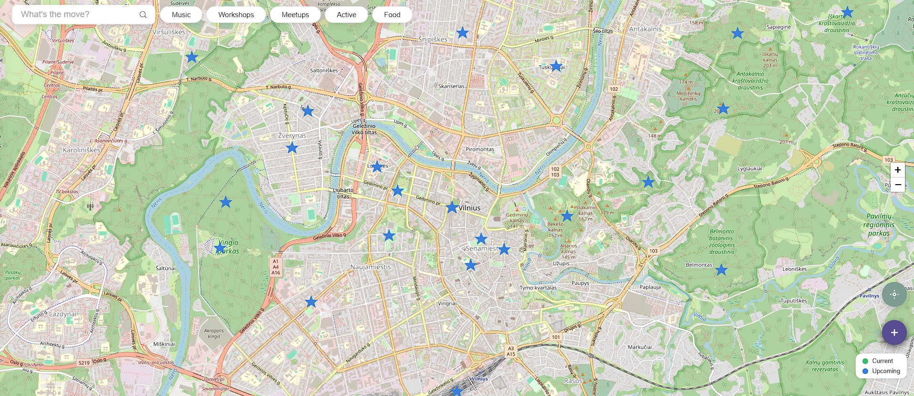

Also maps shows current/upcoming events:   
- 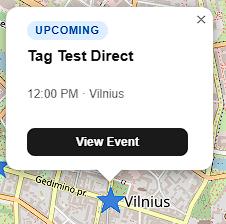
- 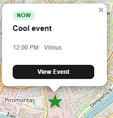

## Creating an Event

> As a user I want to create my own event So that other users can join it.

In current app version we have event creation:
- By Clicking `+`:
  - 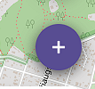
- Opens event creation menu:
  - 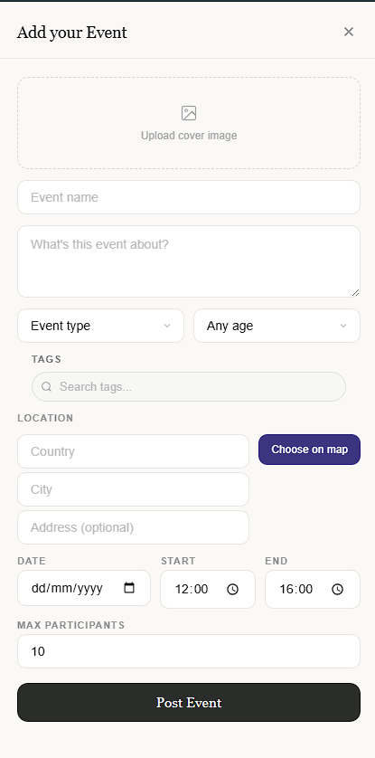

## Age and Participant Limit Restrictions

> As a user I want to other users take into account participant limit restrictions and not see events with age restrictions So that they can only join events that are available to them

- Creating Event With 21+:
  - 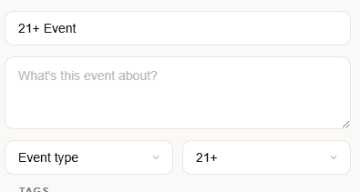
  - 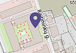
- The user that 18 yo sees:
  - 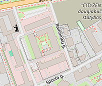

TODO: Participants

## Basic Responsive Interface

> As a user I want to be able to use the app comfortably on different devices (PC, phone) So I can access its features anytime and from any device

It works from PC, phone:
- 
- 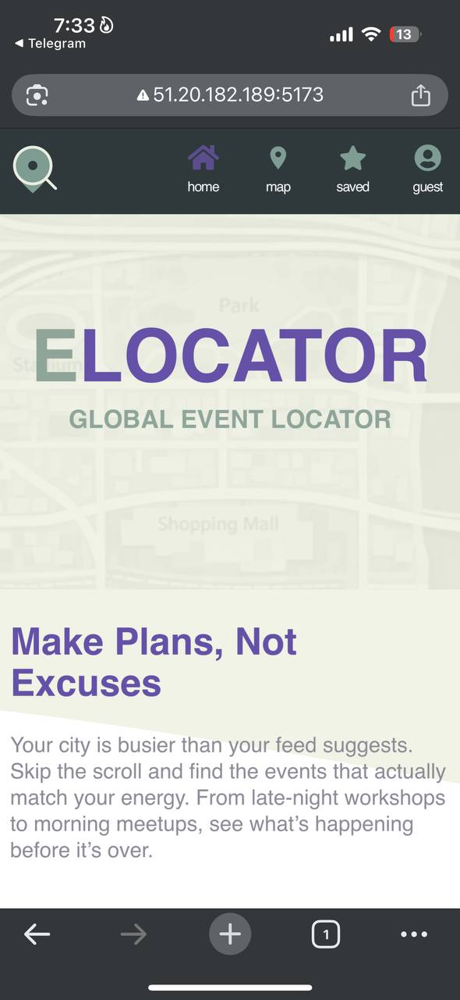

## Event Filtering

> As a user I want to filter events by category, tag, city, and time To quickly find interesting events that match my preferences

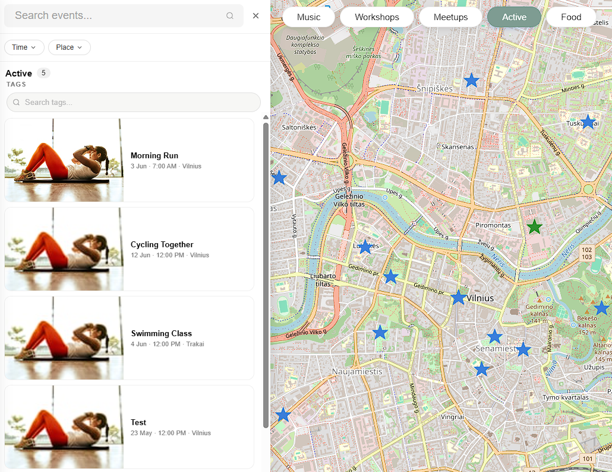

## Not Completed User Stories

### Quickly Join an Event

In the current version of the app, it is not yet possible to connect to an event from the website, but this feature is currently under active development and is scheduled to be ready for future updates.

### Personal Event List

In the current version of the app, it is not yet possible to see joined events from the website, but this feature is currently under active development and is scheduled to be ready for future updates. However now In list user can see every created event as a test view for this presentation.

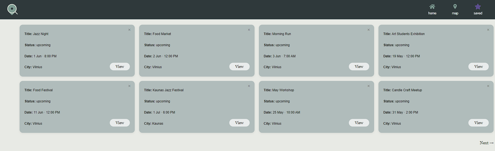

### Event Notifications

In the current version of the app, it is not yet possible to get events from the website, but this feature is currently under active development and is scheduled to be ready for future updates.

### Password Recovery

In the current version of the app, it is not yet possible recover password from the website, but this feature is currently under active development and is scheduled to be ready for future updates. In current time we have almost working algorithm and screen.

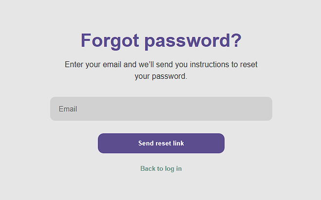

## Check Up

- [x] Backend API работает (аутентификация, CRUD)
- [x] Frontend подключён к API
- [x] База данных наполнена тестовыми данными
- [x] Основные user stories реализованы
- [x] Код покрыт unit-тестами (минимум 50%)

## Conclusion

Overall, the application is currently approximately 80% complete. Considering the current development progress, there is a high probability that the MVP will be successfully completed by the end of this course.
